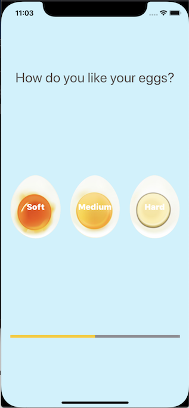

# Egg Timer

## Outline

This app makes me learn to solve problems by exploring StackOverflow, Apple Documentation and how to implement  `scheduledTimer(withTimeInterval:repeats:block:)` type method. But there are also other parts that makes me learn more of the Swift programming concepts. 

## What is Egg Timer

Egg Timer is a timer app to boil eggs depending on how we prefer our eggs(the insides can be soft or medium or hard). The time the egg is boiled, an alert will sound.

## What I've learnt

* Swift Collection types - Dictionaries
* The Swift Timer()
* Conditional statements - If/Else
* Conditional statements - Switch
* Functions with outputs
* How to use the ProgressView

## Screenshot

